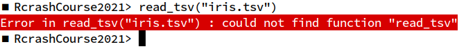
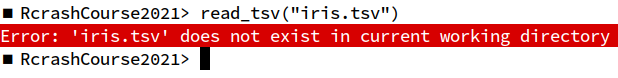

```{r,echo=FALSE}
## Set default options for the knitr RMD processing
knitr::opts_chunk$set(echo=FALSE,warning=FALSE,message=FALSE,fig.width=5,fig.height=5,cache=FALSE,autodep=TRUE, results="hide")
```

```{r libraries,cache=FALSE}
```

# R crash course

## Data


January Weiner <january.weiner@bihealth.de>

Manuela Benary <manuela.benary@bihealth.de>

## Course files

Course repository: https://github.com/bihealth/Rcrashcourse2021

To view the lectures, download the HTML file and open it in a browser.

## Aims

 * Give you a jump start
 * Give you good habits
 * Proceed along a helix

## Let's go!

```{r eval=FALSE,echo=TRUE}
library(tidyverse)
iris <- read_tsv("iris.tsv")
```

Now, go ahead and do it!


## Why doesn't it work?





# How to start

## Examples of R applications

 * Why programming?
 * Why R?
 * Alternatives: Python, matlab, other statistical languages

## Example R session

## The rdesktop workplace

 * Windows
 * Menus
 * Workspace

## Workspaces

 Workspace is basically a folder which contains a few special files in
 which R stores project-specific data.

  * `Rhistory` (hidden file) – a text file containing all commands that you
    have issued
  * `Rdata` (hidden file) – a binary file containing your workspace (all
    variables created)
  * `<filename>.Rproj` – Rstudio R project file containing some
    rstudio-specific settings (text file)
  * Anything else should be save by you

## A few notes on R

 * R vs matlab
 * "There is more than one way of doing it" (but one way will usually be
   optimal)
 * Tidyverse vs standard R (demo)
 * ggplot vs basic plots (demo)

# R language basics

## R language basics

 * Assignment and variables
 * vectors and multiple assignment
 * operators
 * functions

## Excercises 1

 * create variables: a string, a number, a factor
 * create a factor variable 
 

## Excercises 2 

there is a lake in a garden. Every day, the water lilies cover twice as
much area as the previous day. On the first day, the water lilies cover
1/100th of the area of the lake.

 * What is the formula to calculate the area covered by the water lilies on
   day n?
 * assign days 1 ... 10 to variable x. Now assign the fraction of the area
   covered by water lilies on day n to variable y
 * plot x vs y
 * When will the half of the area be covered by water lilies? Use `abline`
   (what does it do?) to show a graphical solution
 
# Good coding practices

## Remember: language is communication

 * Your code will be seen by others
 * And this is a good thing!
 * Documentation *is* important
 * Reproducibility matters


## Literate programming


## Literate programming

I believe that the time is ripe for significantly better documentation
of programs, and that we can best achieve this by considering
programs to be works of literature. Hence, my title: “Literate
Programming.”

Let us change our traditional attitude to the construction of
programs: Instead of imagining that our main task is to instruct a
computer what to do, let us concentrate rather on explaining to
human beings what we want a computer to do.

(Donald E. Knuth)

## Literate programming

The practitioner of literate programming can be regarded as an
essayist, whose main concern is with exposition and excellence of
style. Such an author, with thesaurus in hand, chooses the names of
variables carefully and explains what each variable means. He or she
strives for a program that is comprehensible because its concepts
have been introduced in an order that is best for human
understanding, using a mixture of formal and informal methods that
reinforce each other.

(Donald E. Knuth)

## Documenting your code

 * Better a lousy documentation than none at all
 * Use spaces, empty lines, comments to structure your code
 * COMMENT, COMMENT, COMMENT
 * Document in plain text files and source code files

## Writing code

Keep your code clean:

 * be consistent!
 * use meaningful variable and function names
 * don't use shorthands
 * refactorize
 * create distinct code chunks
 * split the code into meaningful scripts
 * use a formatting style and stick to it

E.g.
http://web.stanford.edu/class/cs109l/unrestricted/resources/google-style.html

## Simplify!

 * make your code as simple as possible
 * make your functions versatile and simple
 * use simple data types if possible
 * don't overdo it!

## You never know

 * what your code evolves into
 * when you will need to publish it
 * when someone will want to see it

…so prepare in advance!
 
 

## Functions

 * If you have to write something more than twice, you should turn it into
   a function!
 * R is a *functional* language

## Creating a function

```
#' Function name
#' Function description
some_name <- function(param1, param2=2) {

## code comment
<your code goes in here>

}


```
